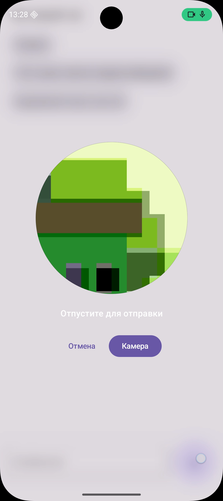

# Video Message Recorder for Android

[English](#english) · [Русский](#русский)

Android library for recording short in-app video messages.

<p align="center">
  <a href="./docs/images/demo-recording.png">
    
  </a>
</p>

Built on Camera2, OpenGL/EGL, MediaCodec, AudioRecord and MediaMuxer.

Repository structure:

- [`app`](app) — minimal demo application and integration example.
- [`video-message-recorder`](video-message-recorder) — reusable Android library module.
- [`docs/INTEGRATION.md`](docs/INTEGRATION.md) — consumer integration guide.
- [`docs/architecture/LIBRARY_ARCHITECTURE.md`](docs/architecture/LIBRARY_ARCHITECTURE.md) — library boundaries and ownership.
- [`docs/architecture/THREADING_REVIEW.md`](docs/architecture/THREADING_REVIEW.md) — current threading model and known issues.

---

# English

## Use cases

The library is intended for video messages inside chats, messengers, social applications and other in-app recording flows.

It supports:

- square video recording with front or rear camera;
- front/rear camera switching during an active recording;
- zoom while recording;
- automatic device-aware recording configuration;
- explicit custom recording configuration;
- host-controlled circular preview;
- optional circular mask baked into the saved MP4;
- optional CSV telemetry for diagnostics.

The library owns the camera and encoding pipeline. The host owns UI, runtime permissions, file persistence, upload and message sending.

**Requirements:** Android API 28+, `CAMERA` and `RECORD_AUDIO` runtime permissions.

## Installation

### Local Gradle module

```kotlin
// settings.gradle.kts
include(":video-message-recorder")
```

```kotlin
// app/build.gradle.kts
dependencies {
    implementation(project(":video-message-recorder"))
}
```

### AAR

Build:

```bash
./gradlew :video-message-recorder:assembleRelease
```

Artifact:

```text
video-message-recorder/build/outputs/aar/video-message-recorder-release.aar
```

Consumer:

```kotlin
dependencies {
    implementation(files("libs/video-message-recorder-release.aar"))
}
```

### Maven Local

Publish from this repository:

```bash
./gradlew :video-message-recorder:publishToMavenLocal
```

Consumer repository configuration:

```kotlin
dependencyResolutionManagement {
    repositories {
        google()
        mavenCentral()
        mavenLocal()
    }
}
```

Consumer dependency:

```kotlin
dependencies {
    implementation(
        "io.github.webarmour:video-message-recorder:0.0.1"
    )
}
```

> The artifact is not published to a public Maven repository yet. This coordinate currently works through `mavenLocal()` after local publication.

## Quick start

```kotlin
val recorder = VideoMessageRecorder(
    context = context.applicationContext,
    mode = RecordingMode.Auto,
    onState = { state ->
        if (state.cameraReady) {
            // Ready to record.
        }
    },
    onRecordingFinished = { result ->
        val videoFile = result.file
        // Hand the file to your own persistence/upload pipeline.
    },
)
```

Permissions:

```kotlin
recorder.setPermissionGranted(
    cameraGranted && microphoneGranted
)
```

Lifecycle:

```kotlin
recorder.onStart()
recorder.onStop()
recorder.close()
```

Preview:

```kotlin
recorder.attachPreview(
    surface = surface,
    width = width,
    height = height,
    displayRotation = displayRotation,
)
```

Controls:

```kotlin
recorder.startRecording()
recorder.stopRecording()
recorder.switchCamera()
recorder.updateZoomRatio(1.5f)
```

Result:

```kotlin
result.file          // finalized MP4
result.baseName      // generated recording name
result.config        // actual RecordingConfig used
result.telemetryCsv  // null when diagnostics are disabled
```

Use `RecordingMode.Auto` for normal production usage. Use `RecordingMode.Custom` only when the application requires explicit parameters.

See [Integration Guide](docs/INTEGRATION.md).

---

# Русский

## Сценарии использования

Библиотека предназначена для видеосообщений внутри чатов, мессенджеров, социальных приложений и других встроенных сценариев записи.

Поддерживаются:

- запись квадратного видео с фронтальной или основной камеры;
- переключение front/rear камеры во время активной записи;
- zoom во время записи;
- автоматический подбор параметров под устройство;
- ручная настройка параметров записи;
- круглый preview на стороне приложения;
- опциональная круглая маска непосредственно в сохранённом MP4;
- опциональная CSV-telemetry для диагностики.

Библиотека управляет камерой и encoding pipeline. UI, runtime permissions, постоянное хранение файла, upload и отправка сообщения остаются на стороне приложения.

**Требования:** Android API 28+, runtime permissions `CAMERA` и `RECORD_AUDIO`.

## Подключение

### Локальный Gradle module

```kotlin
// settings.gradle.kts
include(":video-message-recorder")
```

```kotlin
// app/build.gradle.kts
dependencies {
    implementation(project(":video-message-recorder"))
}
```

### AAR

Собрать:

```bash
./gradlew :video-message-recorder:assembleRelease
```

Файл:

```text
video-message-recorder/build/outputs/aar/video-message-recorder-release.aar
```

Подключение в другом проекте:

```kotlin
dependencies {
    implementation(files("libs/video-message-recorder-release.aar"))
}
```

### Maven Local

Опубликовать локально:

```bash
./gradlew :video-message-recorder:publishToMavenLocal
```

В consumer-проекте:

```kotlin
dependencyResolutionManagement {
    repositories {
        google()
        mavenCentral()
        mavenLocal()
    }
}
```

```kotlin
dependencies {
    implementation(
        "io.github.webarmour:video-message-recorder:0.0.1"
    )
}
```

> В публичном Maven-репозитории библиотека пока не опубликована. Сейчас эта dependency работает через `mavenLocal()` после локальной публикации.

## Быстрый старт

```kotlin
val recorder = VideoMessageRecorder(
    context = context.applicationContext,
    mode = RecordingMode.Auto,
    onState = { state ->
        if (state.cameraReady) {
            // Можно начинать запись.
        }
    },
    onRecordingFinished = { result ->
        val videoFile = result.file
        // Передать файл в свой storage/upload pipeline.
    },
)
```

Permissions:

```kotlin
recorder.setPermissionGranted(
    cameraGranted && microphoneGranted
)
```

Lifecycle:

```kotlin
recorder.onStart()
recorder.onStop()
recorder.close()
```

Preview:

```kotlin
recorder.attachPreview(
    surface = surface,
    width = width,
    height = height,
    displayRotation = displayRotation,
)
```

Управление:

```kotlin
recorder.startRecording()
recorder.stopRecording()
recorder.switchCamera()
recorder.updateZoomRatio(1.5f)
```

Результат:

```kotlin
result.file          // готовый MP4
result.baseName      // имя записи
result.config        // фактически использованный RecordingConfig
result.telemetryCsv  // null при выключенной диагностике
```

Для обычного production-сценария используйте `RecordingMode.Auto`. `RecordingMode.Custom` нужен только при необходимости явно задавать параметры.

Полная документация: [Integration Guide](docs/INTEGRATION.md).
